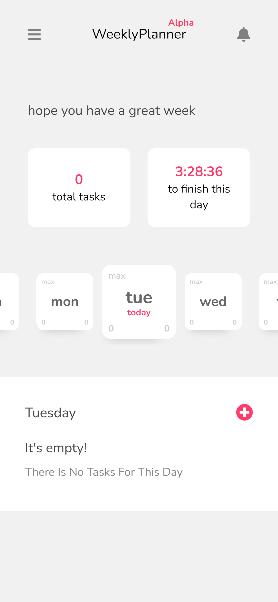
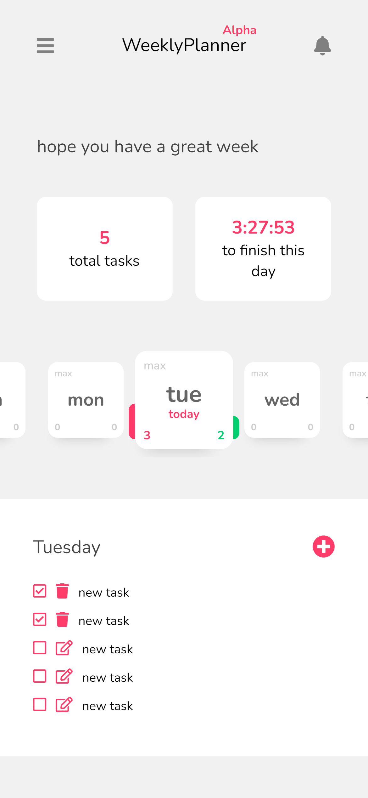

A week planner web app in which you can see only the days of the week and save tasks for each day (in progress)
V1

<h1 align="center">
  <br>
  
</h1>

<h4 align="center">A minimal todo app built on top of <a href="https://es.reactjs.org/" target="_blank">React.js</a>.</h4>

<br>
<br>

<p>This is my app where you can discover all of my stack as a Front End.</p>
<p>This is the 1.0 version of my week planner app idea, take in consideration that is totally deprecated... so i'm doing a new version <a href="https://github.com/Aranguez/weekly-planner" target="_blank">here in this repo</a></p>
<p>I'm glad if you are here checking out my progress!</p>

<hr/>

<p align="center">
  <a href="#key-features">Key Features</a> •
  <a href="#how-to-use">How To Use</a> •
</p>

<div>
  
  
</div>

## Key Features

* Check your busy days by colors
* Set a limit of todos per day
* Add, edit, delete todos
* Your own profile with secure login
* All your data on a mongodb database
* Dark/Light mode

## How To Use

To clone and run this application, you'll need [Git](https://git-scm.com) and [Node.js](https://nodejs.org/en/download/) (which comes with [npm](http://npmjs.com)) installed on your computer. From your command line:

```bash
# Clone this repository
$ git clone https://github.com/Aranguez/week-planner-v1.git

# Go into the repository
$ cd week-planner-v1

# Install dependencies
$ npm install

# Run the app
$ npm run dev
```